# UML Class Diagram - React Company Profile PT Jaya Beton Indonesia

## Class Diagram

```plantuml
@startuml Company_Profile_Class_Diagram

' Styling
skinparam classAttributeIconSize 0
skinparam class {
    BackgroundColor<<Component>> LightBlue
    BackgroundColor<<Service>> LightGreen
    BackgroundColor<<Data>> LightYellow
    BorderColor Black
    ArrowColor Black
}

' Main Application Component
class App <<Component>> {
    - landingPageData: Object
    + useEffect(): void
    + setLandingPageData(data): void
    + render(): JSX.Element
}

' Navigation Component
class Navigation <<Component>> {
    + render(): JSX.Element
}

' Header Component
class Header <<Component>> {
    + props.data: HeaderData
    + render(): JSX.Element
}

' Gallery Component
class Gallery <<Component>> {
    + props.data: GalleryData[]
    + render(): JSX.Element
}

' Image Component
class Image <<Component>> {
    + props.title: string
    + props.largeImage: string
    + props.smallImage: string
    + render(): JSX.Element
}

' Features Component
class Features <<Component>> {
    - modalOpen: boolean
    - selectedFeature: Feature
    + handleFeatureClick(feature): void
    + handleCloseModal(): void
    + render(): JSX.Element
}

' FeatureModal Component
class FeatureModal <<Component>> {
    - currentIndex: number
    + props.isOpen: boolean
    + props.onClose: function
    + props.category: string
    + props.images: Image[]
    + props.folder: string
    + nextSlide(): void
    + prevSlide(): void
    + goToSlide(index): void
    + render(): JSX.Element
}

' About Component
class About <<Component>> {
    + props.data: AboutData
    + render(): JSX.Element
}

' Services Component
class Services <<Component>> {
    + props.data: ServiceData[]
    + render(): JSX.Element
}

' Contact Component
class Contact <<Component>> {
    - name: string
    - email: string
    - message: string
    + props.data: ContactData
    + handleChange(event): void
    + handleSubmit(event): void
    + clearState(): void
    + render(): JSX.Element
}

' Footer Component
class Footer <<Component>> {
    + props.data: FooterData
    + render(): JSX.Element
}

' Data Models
class JsonData <<Data>> {
    + Header: HeaderData
    + Gallery: GalleryData[]
    + Features: FeatureData[]
    + About: AboutData
    + Services: ServiceData[]
    + Contact: ContactData
    + Footer: FooterData
}

class HeaderData <<Data>> {
    + title: string
    + paragraph: string
}

class GalleryData <<Data>> {
    + title: string
    + largeImage: string
    + smallImage: string
}

class FeatureData <<Data>> {
    + icon: string
    + title: string
    + folder: string
    + images: ImageData[]
}

class ImageData <<Data>> {
    + filename: string
    + title: string
}

class AboutData <<Data>> {
    + paragraphs: string[]
    + Why: string[]
    + Why2: string[]
}

class ServiceData <<Data>> {
    + icon: string
    + name: string
    + text: string
}

class ContactData <<Data>> {
    + address: string
    + phone: string
    + fax: string
    + email: string
    + facebook: string
    + whatsapp: string
    + twitter: string
    + youtube: string
}

class FooterData <<Data>> {
    + logo: string
    + description: string
    + address: string
    + email: string
    + phone: string
    + fax: string
    + factoryLocations: string[]
    + businessHours: Object
    + downloadText: string
    + downloadLink: string
    + social: Object
    + copyright: string
}

' External Services
class EmailJS <<Service>> {
    + sendForm(serviceId, templateId, form, userId): Promise
}

class SmoothScroll <<Service>> {
    + constructor(selector, options)
    + animateScroll(target): void
}

' Relationships

' App relationships
App "1" *-- "1" Navigation : contains
App "1" *-- "1" Header : contains
App "1" *-- "1" Gallery : contains
App "1" *-- "1" Features : contains
App "1" *-- "1" About : contains
App "1" *-- "1" Services : contains
App "1" *-- "1" Contact : contains
App "1" *-- "1" Footer : contains
App ..> JsonData : uses
App ..> SmoothScroll : uses

' Gallery relationships
Gallery "1" *-- "0..*" Image : contains
Gallery ..> GalleryData : uses

' Features relationships
Features "1" *-- "0..1" FeatureModal : contains
Features ..> FeatureData : uses

' FeatureModal relationships
FeatureModal ..> ImageData : uses

' Component data dependencies
Header ..> HeaderData : uses
About ..> AboutData : uses
Services ..> ServiceData : uses
Contact ..> ContactData : uses
Contact ..> EmailJS : uses
Footer ..> FooterData : uses

' JsonData relationships
JsonData "1" *-- "1" HeaderData : contains
JsonData "1" *-- "0..*" GalleryData : contains
JsonData "1" *-- "0..*" FeatureData : contains
JsonData "1" *-- "1" AboutData : contains
JsonData "1" *-- "0..*" ServiceData : contains
JsonData "1" *-- "1" ContactData : contains
JsonData "1" *-- "1" FooterData : contains

' FeatureData relationships
FeatureData "1" *-- "0..*" ImageData : contains

@enduml
```

## Penjelasan Class Diagram

### 1. **Komponen Utama (Components)**

- **App**: Komponen root yang mengelola state aplikasi dan mengatur layout
- **Navigation**: Komponen navigasi menu
- **Header**: Komponen header/hero section
- **Gallery**: Komponen galeri proyek
- **Image**: Komponen untuk menampilkan gambar individual
- **Features**: Komponen untuk menampilkan kategori produk
- **FeatureModal**: Modal untuk menampilkan detail produk dengan carousel
- **About**: Komponen tentang perusahaan
- **Services**: Komponen layanan perusahaan
- **Contact**: Komponen form kontak dengan integrasi EmailJS
- **Footer**: Komponen footer

### 2. **Data Models**

- **JsonData**: Model data utama yang berisi semua data aplikasi
- **HeaderData, GalleryData, FeatureData, dll**: Model data spesifik untuk setiap section

### 3. **External Services**

- **EmailJS**: Service untuk mengirim email dari contact form
- **SmoothScroll**: Library untuk smooth scrolling navigation

### 4. **Relationships**

- **Composition (◆)**: App mengandung semua komponen child
- **Dependency (- - >)**: Komponen menggunakan data models dan services
- **Aggregation**: JsonData mengandung berbagai data models

## Karakteristik Arsitektur

1. **Component-Based Architecture**: Aplikasi dibangun dengan komponen React yang reusable
2. **Props-Based Data Flow**: Data mengalir dari parent (App) ke child components melalui props
3. **State Management**: Menggunakan React Hooks (useState, useEffect) untuk state management
4. **Separation of Concerns**: Pemisahan antara UI components, data models, dan external services
5. **Single Source of Truth**: Data disimpan dalam satu file JSON (data.json)
