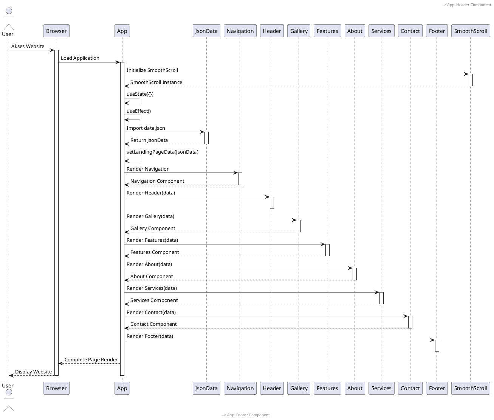
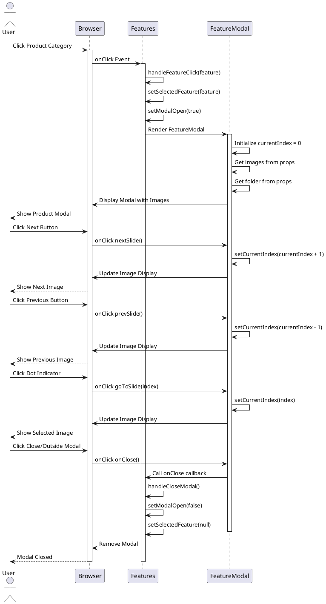
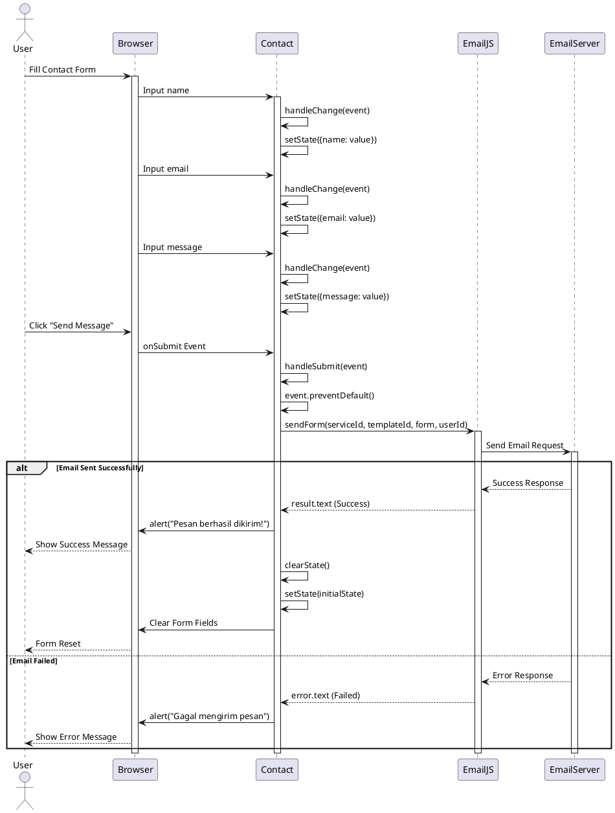
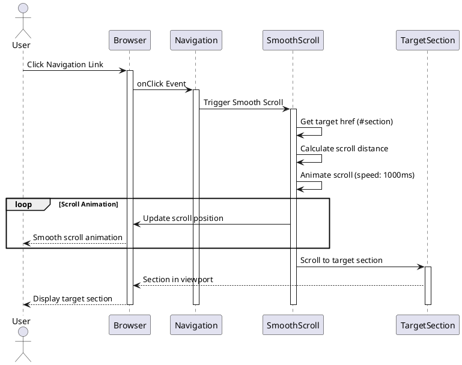
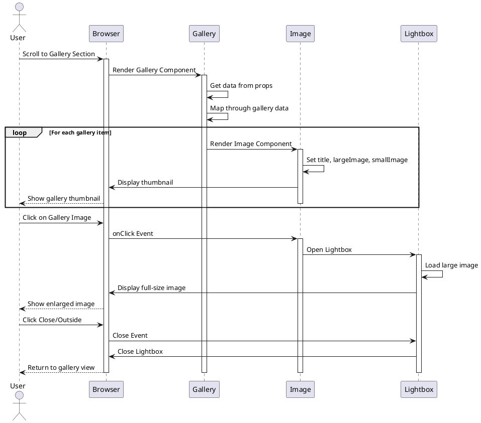

# UML Sequence Diagrams - React Company Profile PT Jaya Beton Indonesia

## 1. Sequence Diagram: Inisialisasi Aplikasi

## 2. Sequence Diagram: User Membuka Modal Produk

## 3. Sequence Diagram: User Mengirim Contact Form

## 4. Sequence Diagram: User Navigasi Smooth Scroll

## 5. Sequence Diagram: User Melihat Gallery

## Penjelasan Sequence Diagrams

### 1. **Inisialisasi Aplikasi**

Menunjukkan proses loading aplikasi dari awal hingga semua komponen ter-render:

- Browser memuat aplikasi
- App component melakukan initialization
- Data dimuat dari JSON
- Semua child components di-render secara berurutan
- SmoothScroll diinisialisasi untuk navigasi

### 2. **Membuka Modal Produk**

Menunjukkan interaksi user dengan fitur modal produk:

- User mengklik kategori produk
- Modal terbuka dengan carousel images
- User dapat navigasi antar gambar (next, prev, dots)
- User dapat menutup modal

### 3. **Mengirim Contact Form**

Menunjukkan proses pengiriman form kontak:

- User mengisi form (name, email, message)
- State di-update setiap ada perubahan input
- Form di-submit ke EmailJS
- EmailJS mengirim ke email server
- Menampilkan success/error message
- Form di-reset jika berhasil

### 4. **Navigasi Smooth Scroll**

Menunjukkan proses smooth scrolling saat navigasi:

- User mengklik link navigasi
- SmoothScroll library menganimasikan scroll
- Browser scroll ke section target dengan smooth animation

### 5. **Melihat Gallery**

Menunjukkan interaksi user dengan gallery:

- Gallery component me-render semua thumbnail
- User mengklik thumbnail
- Lightbox membuka gambar full-size
- User dapat menutup lightbox

## Karakteristik Interaksi

1. **Event-Driven**: Semua interaksi dimulai dari user action
2. **State Management**: Perubahan state memicu re-render component
3. **Asynchronous Operations**: EmailJS menggunakan Promise untuk operasi async
4. **Component Communication**: Parent-child communication melalui props dan callbacks
5. **External Service Integration**: Integrasi dengan EmailJS dan SmoothScroll library
